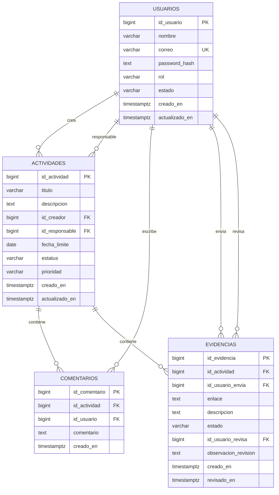

# Diagrama de base de datos — TASK BLOQ

```mermaid
erDiagram
    USUARIOS ||--o{ ACTIVIDADES : crea
    USUARIOS ||--o{ ACTIVIDADES : responsable
    USUARIOS ||--o{ COMENTARIOS : escribe
    USUARIOS ||--o{ EVIDENCIAS : envia
    USUARIOS ||--o{ EVIDENCIAS : revisa

    ACTIVIDADES ||--o{ COMENTARIOS : contiene
    ACTIVIDADES ||--o{ EVIDENCIAS : contiene

    USUARIOS {
        bigint id_usuario PK
        varchar nombre
        varchar correo UK
        text password_hash
        varchar rol
        varchar estado
        timestamptz creado_en
        timestamptz actualizado_en
    }

    ACTIVIDADES {
        bigint id_actividad PK
        varchar titulo
        text descripcion
        bigint id_creador FK
        bigint id_responsable FK
        date fecha_limite
        varchar estatus
        varchar prioridad
        timestamptz creado_en
        timestamptz actualizado_en
    }

    COMENTARIOS {
        bigint id_comentario PK
        bigint id_actividad FK
        bigint id_usuario FK
        text comentario
        timestamptz creado_en
    }

    EVIDENCIAS {
        bigint id_evidencia PK
        bigint id_actividad FK
        bigint id_usuario_envia FK
        text enlace
        text descripcion
        varchar estado
        bigint id_usuario_revisa FK
        text observacion_revision
        timestamptz creado_en
        timestamptz revisado_en
    }
```